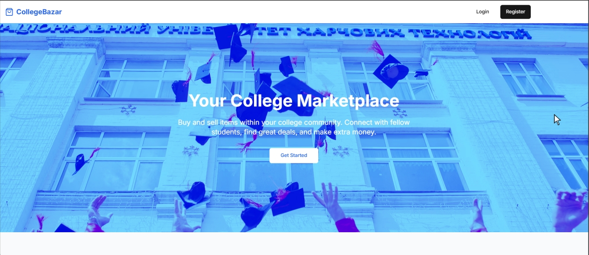

# 🚀 College Bazar Backend API

Welcome to the **Backend API** for **College Bazar**. This repository powers the backend services, handling authentication, database interactions, and business logic.



## 📌 Features

- 🔐 **Authentication & Authorization** (JWT)
- 🗄️ **Database Management** (MongoDB)
- ⚡ **High Performance & Scalable**
- 📡 **RESTful APIs**
- 🛡️ **Security Best Practices**
- 🏗️ **Docker & CI/CD Ready**


## 📁 Project Structure
```
📦 college-bazar-backend
    ├── 📁 assets/        # Static assets like images
    ├── 📁 controllers/   # Contains all the controllers 
    ├── 📁 middlewares/   # Contains Middleware Code
    ├── 📁 models/        # Code for the global models (mongo collections)
    ├── 📁 routes/        # All the routes are defined in this
    └── 📄 Dockerfile/    # Docker file to run the application
```
---

## 🚀 Getting Started

### 1️⃣ Prerequisites

Ensure you have the following installed:

- Golang (v1.23)
- MongoDb
- Docker

### 2️⃣ Installation

Clone the repository and install dependencies:

```bash
git clone https://github.com/ayush3160/college-bazar-backend.git
cd college-bazar-backend
go mod download
```

### 3️⃣ Environment Variables

Copy the environment variables present in .env.local file and create a new .env file.

```bash
PORT=8000
MONGO_URI=mongodb://localhost:27017/college-bazar
MONGO_DB_NAME=college-bazar
JWT_SECRET=some-random-jwt-secret-key
```

### 4️⃣ Running the Application

For Development

```bash
go run main.go --debug --development
```

For Production

```bash
go run main.go
```

### 5️⃣ Running with Docker

```bash
docker compose up --build
```

## 🤝 Contributing
#### 1. Fork the repository.
#### 2. Create a new branch: git checkout -b feature-name
#### 3. Commit your changes: git commit -m "Added feature"
#### 4. Push to the branch: git push origin feature-name
#### 5. Submit a Pull Request.